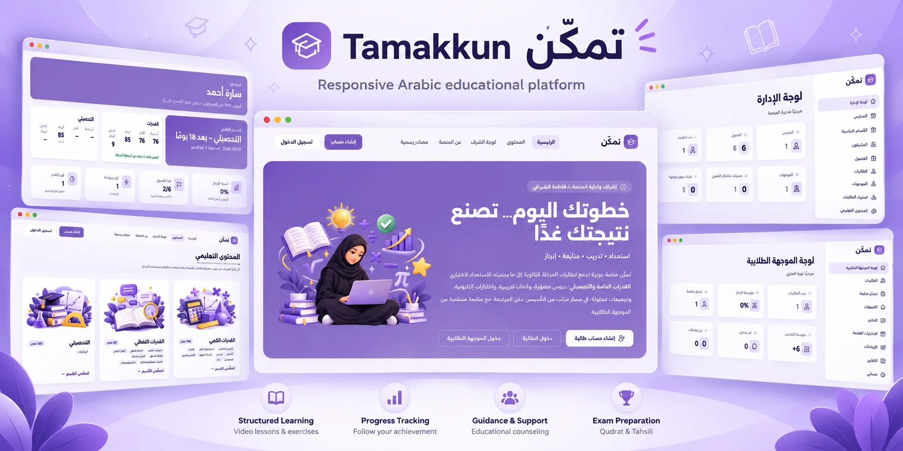
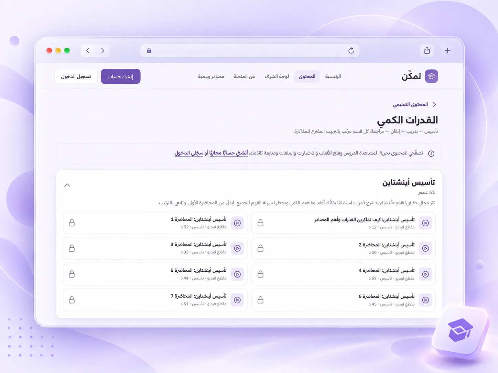
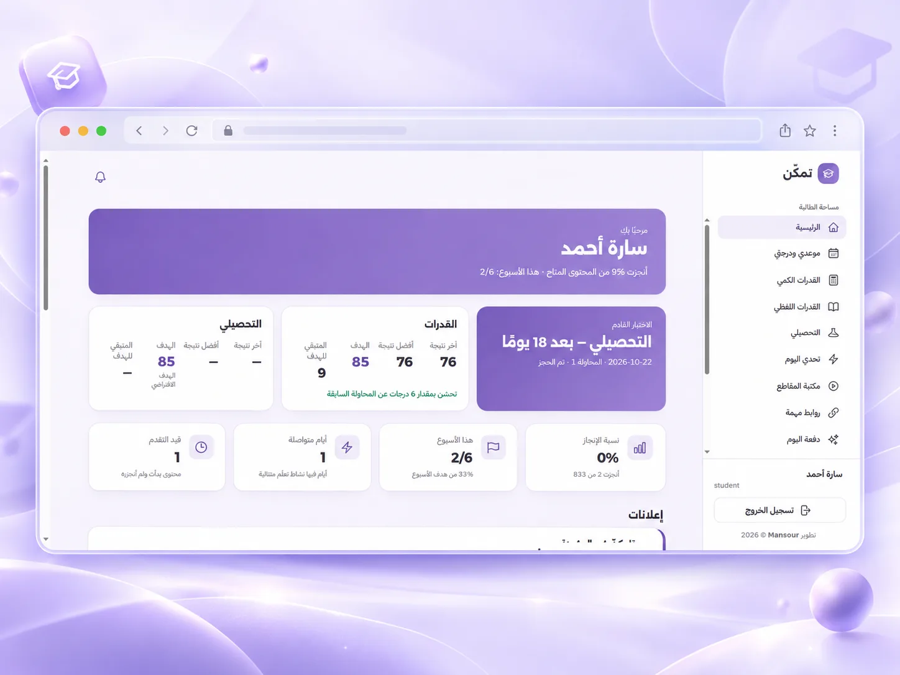
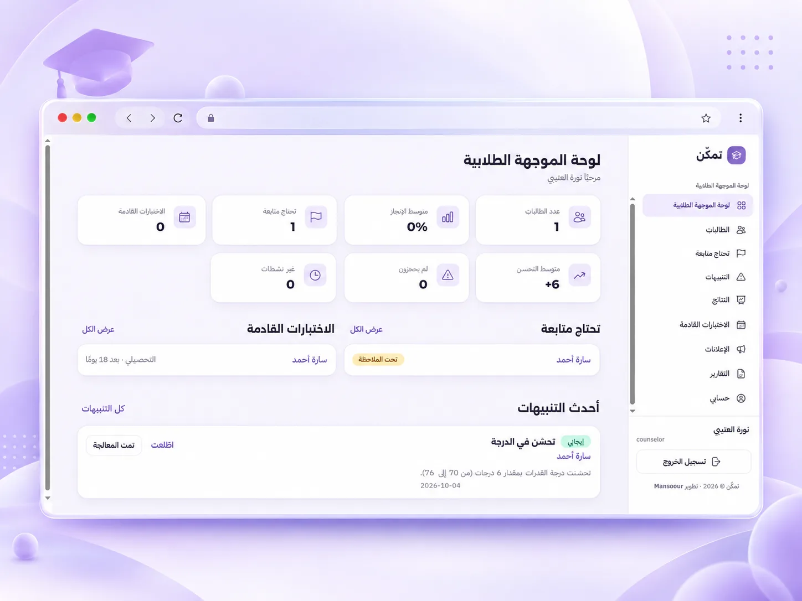
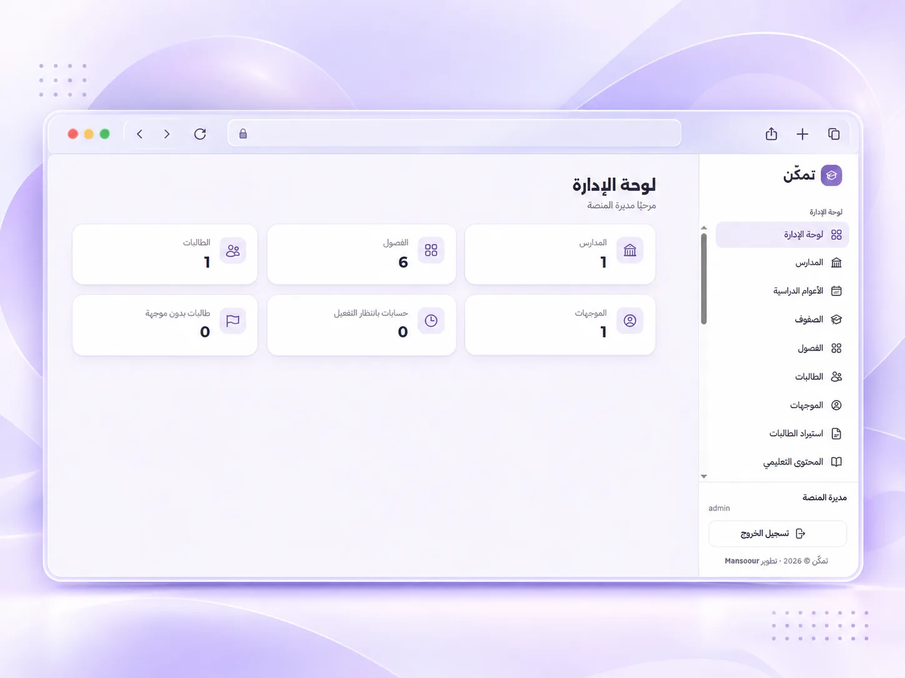
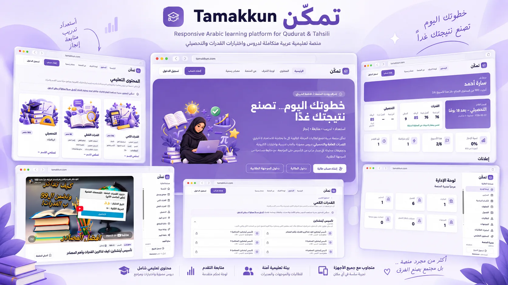

# Tamakkun (تمكّن)



> خطوتك اليوم… تصنع نتيجتك غدًا
> استعداد • تدريب • متابعة • إنجاز

**Tamakkun** is a responsive, Arabic-first (RTL) learning platform for female secondary-school students (Grades 10–12) preparing for the **Qudurat** (القدرات العامة, General Aptitude Test) and **Tahsili** (التحصيلي, Achievement Test) exams, and for the school counselors who follow their progress. The platform is run under the supervision of **أ. فاطمة الشهراني** and developed by **[Mansoour](https://mansoour.com)**.

- **Visitors** browse every section, category and lesson title, see the top students on «لوحة الشرف», and create a student account in under a minute.
- **Students** (mostly on mobile browsers) learn in a set order (تأسيس ← تدريب ← إتقان ← مراجعة): embedded video lessons, interactive games, e-tests and reference files, plus a daily challenge, daily motivation, exam-date and score tracking, badges and personal progress.
- **Counselors** (mostly on desktop/tablet) monitor assigned students, see who needs follow-up, review scores and activity, send announcements and run PDF/CSV reports.
- **Admins** manage schools, classes, users, roles, content, registration and settings.

The site is built website-first. A native mobile app may come later, so business logic lives in services that a future `/api/v1` can reuse.

**Current version: v0.9 plus the unreleased content and features listed in [CHANGELOG.md](CHANGELOG.md).** The roadmap is in [docs/decisions.md](docs/decisions.md).

---

## Highlights

| Area | What is included |
|---|---|
| **Content** | **833 published items**: القدرات الكمي (266), القدرات اللفظي (66) and التحصيلي – رياضيات (501, in 29 chapters for Grades 10–12). Includes 400 embedded YouTube lessons, 383 games and e-tests (Wordwall, Quizalize, Google/Microsoft Forms) and 50 reference files. Each item is placed in the skill or chapter it covers. See [docs/content-sources.md](docs/content-sources.md). |
| **Daily engagement** | 20 ready-made «تحدي اليوم» challenges (60 questions with explanations) and 16 «دفعة اليوم» motivation items. |
| **Public site** | Navbar, home page with live numbers, browsable content catalogue (`/content`, every item opens only after sign-in), «لوحة الشرف» (`/leaderboard`, first name and family initial only), about and resources pages. |
| **Accounts** | Student self-registration (school → grade → classroom; email required; open / approval / closed setting). Counselor and admin accounts are created by an admin. |
| **Safety** | A privacy warning on every external link (no real personal data; use a dummy phone number). Role-based permissions, audit log, rate limits and encrypted backups. |
| **Arabic-first UI** | Full RTL including form fields, dropdown arrows and the page scrollbar. Alexandria and IBM Plex Sans Arabic fonts. Installable on the home screen. |

## Screenshots

| Home page | Content catalogue |
|---|---|
|  |  |
| **Section with lessons** | **Lesson page (embedded video)** |
|  |  |
| **Student dashboard** | **Counselor dashboard** |
|  |  |
| **Admin dashboard** | **Overview** |
|  |  |

Screenshots use the local demo data only (no real students).

---

## Tech stack

| Layer | Technology |
|---|---|
| Language / framework | PHP 8.3, Laravel 13 |
| Database | MariaDB/MySQL (local: MariaDB 10.4 via XAMPP · server: MariaDB 10.3) |
| Tests | PHPUnit 12 on SQLite in memory |
| Views | Blade (server-rendered), Alpine.js 3, Tailwind CSS 3 (`forms`, `typography`) |
| Build | Vite 8 |
| Fonts | Alexandria 700/800 (headings and display), IBM Plex Sans Arabic 400/500/700 (body and UI) via Bunny Fonts |
| Icons | Heroicons, SVG paths in `config/icons.php`, rendered with `<x-icon name="…" />` |
| Auth / permissions | Laravel Breeze (Blade), `spatie/laravel-permission` |
| Other | `spatie/laravel-backup`, `mpdf/mpdf`, `resend/resend-php`, `laravel-lang/lang` (Arabic), Laravel Boost, Pint, Pail |

No React, no Vue, no SPA.

---

## Requirements

- PHP **8.3** with extensions: `bcmath`, `ctype`, `curl`, `fileinfo`, `gd`, `intl`, `mbstring`, `openssl`, `pdo_mysql`, `pdo_sqlite`, `tokenizer`, `xml`, `zip`
- Composer 2
- Node.js 22+ and npm
- MariaDB 10.3+ or MySQL 8

### PHP path note (developer PC)

Use the standalone PHP 8.3 at:

```text
C:\php\php.exe
```

Do **not** use the older PHP that ships with XAMPP. Check with `php -v` (or call `C:\php\php.exe` directly) before running any command below.

The full step-by-step Windows guide, including which `php.ini` extensions to enable and a troubleshooting table, is in **[docs/windows-setup.md](docs/windows-setup.md)**.

### XAMPP / MySQL note

XAMPP is used **only** for MariaDB/MySQL. Do not serve the site through XAMPP Apache. Run Laravel with `php artisan serve` instead.

Create the local database once (phpMyAdmin or the MySQL shell):

```sql
CREATE DATABASE tamakkun CHARACTER SET utf8mb4 COLLATE utf8mb4_unicode_ci;
```

---

## Local setup

```bash
git clone git@github.com:mansoour/Tamakkun.git
cd Tamakkun
git checkout develop

composer install
cp .env.example .env          # Windows: copy .env.example .env
php artisan key:generate
```

### `.env`

`.env.example` is preconfigured for XAMPP's MariaDB:

```dotenv
DB_CONNECTION=mysql
DB_HOST=127.0.0.1
DB_PORT=3306
DB_DATABASE=tamakkun
DB_USERNAME=root
DB_PASSWORD=

MAIL_MAILER=log               # never send real email locally
APP_LOCALE=ar
APP_TIMEZONE=Asia/Riyadh
```

`.env` only holds what the app needs before it can boot. Everything an admin may want to change lives in the `settings` table (see [docs/architecture.md](docs/architecture.md#settings)). Never commit `.env`.

### Migrations and seeders

```bash
php artisan migrate           # creates tables, roles, permissions and the seeded content structure
php artisan storage:link      # serves uploaded thumbnails
php artisan db:seed           # local/testing only: fake demo users
# or both from scratch:
php artisan migrate:fresh --seed
```

Roles and permissions are created by **migrations**, not seeders, so seeding can never reset production role assignments.

### Frontend (npm)

```bash
npm install
npm run dev                   # Vite dev server with hot reload, keep it running
```

Before deploying, build the assets with `npm run build`. The output goes to `public/build`, which is generated and never committed.

### Check and run the site

```bash
php artisan tamakkun:doctor   # checks PHP, extensions, database, migrations, storage and assets
php artisan serve             # http://localhost:8000
```

### Demo credentials (local only)

`php artisan db:seed` creates these **fake** accounts in one demo school (مدرسة تمكّن الثانوية, grades 1–3, two classrooms each). All passwords are `password`. Learning content, تحدي اليوم and دفعة اليوم are real and come from migrations, not the seeder.

| Role | Login (username or email) |
|---|---|
| Admin (مديرة المنصة) | `admin` or `admin@tamakkun.test` |
| Counselor (نورة العتيبي) | `counselor` or `counselor@tamakkun.test` |
| Student (سارة أحمد, 3/1) | `student` |

The seeder refuses to run in production. For a real install, create the first admin with `php artisan tamakkun:create-admin`.

Students can also create their own account at `/register` (school → grade → classroom). An admin controls this under **الإعدادات ← تسجيل الطالبات**: open, approval or closed.

### Laravel Boost (Claude Code)

`CLAUDE.md` is generated by Laravel Boost from `.ai/guidelines/tamakkun.md`. After cloning, or after editing those guidelines, run:

```bash
php artisan boost:update
```

This regenerates `CLAUDE.md` and the local `.claude/skills` (which are never committed).

---

## Everyday commands

| Task | Command |
|---|---|
| Run tests | `vendor/bin/phpunit` |
| Format code (before every commit) | `vendor/bin/pint --dirty` |
| Check formatting like CI | `vendor/bin/pint --test` |
| Live log viewer | `php artisan pail` |
| Queue worker (local) | `php artisan queue:work` |
| Run the scheduler locally | `php artisan schedule:work` |
| List routes | `php artisan route:list --except-vendor` |
| Check this machine's setup | `php artisan tamakkun:doctor` |
| Create an admin account | `php artisan tamakkun:create-admin` |

### Queue

Emails and notifications are queued (`QUEUE_CONNECTION=database`). Locally, run `php artisan queue:work` in a separate terminal when testing anything that sends mail. In production the worker runs as a systemd service; see [docs/deployment.md](docs/deployment.md).

### Scheduler

Scheduled tasks are defined in `routes/console.php`: nightly backups, the daily alert refresh, morning reminders and scheduled announcements (`tamakkun:refresh-alerts`, `tamakkun:send-reminders`, `tamakkun:dispatch-announcements`). In production, cron runs `php artisan schedule:run` every minute. Locally, use `php artisan schedule:work`.

---

## Deployment

Production runs on a Rocky Linux VPS with CyberPanel, OpenLiteSpeed, `lsphp83` and MariaDB. The full procedure, including first install, web root, permissions, systemd queue worker, cron, SSH over port 443 and the update steps, is in **[docs/deployment.md](docs/deployment.md)**.

The short version of an update:

```bash
git pull
composer install --no-dev --optimize-autoloader
php artisan migrate --force
npm ci && npm run build
php artisan optimize
sudo systemctl restart tamakkun-queue
```

---

## Git workflow (private repository)

The repository is **private**.

| Branch | Purpose |
|---|---|
| `develop` | Daily work. Every finished change is committed here. |
| `main` | What the live server runs. Always a fast-forward of `develop`. |

For each change:

1. Work on `develop`.
2. Run `vendor/bin/phpunit`; it must pass.
3. Run `vendor/bin/pint --dirty`; it must be clean.
4. Update `docs/` and `CHANGELOG.md`.
5. Commit with a `feat:`, `fix:` or `chore:` message, then push `develop`.
6. Fast-forward `main`: `git checkout main && git merge --ff-only develop && git push origin main`.

Never commit `.env`, `vendor/`, `node_modules/`, `public/build/`, backups, database dumps or `.claude/`. More detail is in [docs/workflow.md](docs/workflow.md).

---

## Documentation

| Topic | File |
|---|---|
| Architecture, design system, conventions | [docs/architecture.md](docs/architecture.md) |
| Windows / XAMPP setup | [docs/windows-setup.md](docs/windows-setup.md) |
| Database tables | [docs/database-schema.md](docs/database-schema.md) |
| Roles and permissions | [docs/roles-permissions.md](docs/roles-permissions.md) |
| Development workflow | [docs/workflow.md](docs/workflow.md) |
| Deployment | [docs/deployment.md](docs/deployment.md) |
| Security | [docs/security.md](docs/security.md) |
| Backups | [docs/backups.md](docs/backups.md) |
| Email | [docs/email.md](docs/email.md) |
| Testing | [docs/testing.md](docs/testing.md) |
| Student CSV import | [docs/imports.md](docs/imports.md) |
| Content sources and copyright | [docs/content-sources.md](docs/content-sources.md) |
| Progress formulas | [docs/progress.md](docs/progress.md) |
| Exam tracking | [docs/exams.md](docs/exams.md) |
| Counselor follow-up and alerts | [docs/alerts.md](docs/alerts.md) |
| Challenge, motivation, announcements, notifications | [docs/engagement.md](docs/engagement.md) |
| Reports (PDF/CSV) | [docs/reports.md](docs/reports.md) |
| Quizzes | [docs/quizzes.md](docs/quizzes.md) |
| Site graphics (sizes, palette, prompts) | [docs/graphics.md](docs/graphics.md) |
| Decisions and roadmap | [docs/decisions.md](docs/decisions.md) |

## Development with Claude Code cloud sessions

This project is also developed with [Claude Code](https://claude.ai/code) cloud sessions. Each session runs in an isolated cloud environment: it clones this repository, works on a branch, runs the tests and Pint, and pushes its commits back to GitHub for review.

## License

Copyright © 2026 [Mansoour](https://mansoour.com). All rights reserved.

Private and proprietary; see [LICENSE](LICENSE). Developed by [Mansoour](https://mansoour.com).
